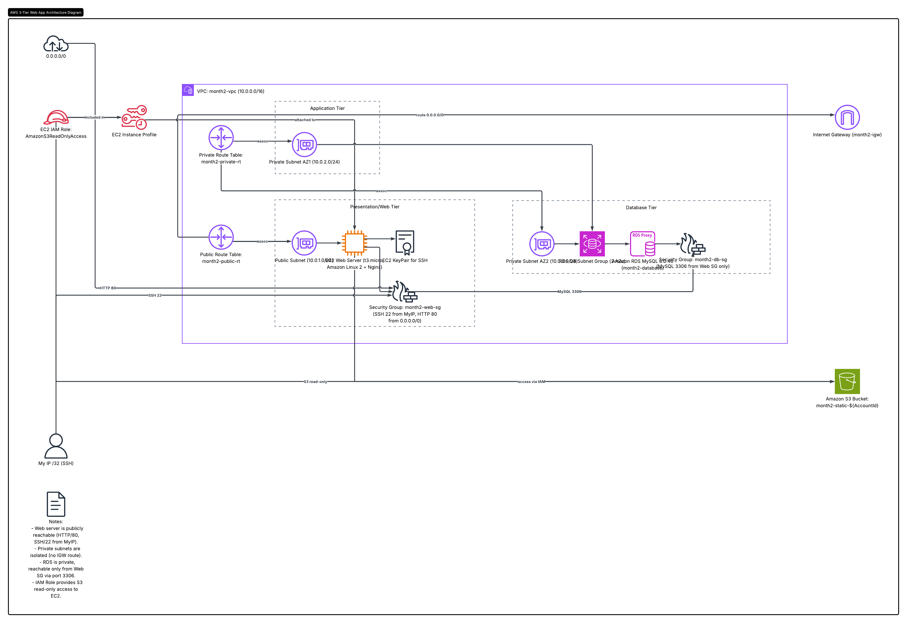

# Month 2 Project – AWS 3-Tier Web Application using CloudFormation

## 📖 Project Overview

This project deploys a **3-Tier Web Application** on **Amazon Web Services (AWS)** using **Infrastructure as Code (IaC)** with **AWS CloudFormation**.

The infrastructure provisions a secure AWS environment consisting of:

* Custom VPC
* Public & Private Subnets
* Internet Gateway
* Route Tables
* EC2 Web Server (Amazon Linux 2 + Nginx)
* Amazon RDS MySQL Database
* Amazon S3 Bucket
* IAM Role & Instance Profile
* Security Groups

The solution demonstrates AWS networking, compute, storage, database, IAM, and Infrastructure as Code best practices.

---

# 🏗️ Architecture Diagram

The following diagram illustrates the infrastructure deployed by the CloudFormation template.



---

# 🏛️ 3-Tier Architecture

| Tier                  | Component        | Purpose                                   |
| --------------------- | ---------------- | ----------------------------------------- |
| **Presentation Tier** | EC2 + Nginx      | Serves web content to users               |
| **Application Tier**  | EC2 + IAM Role   | Securely accesses AWS services such as S3 |
| **Database Tier**     | Amazon RDS MySQL | Stores application data                   |

---

# 🚀 AWS Resources

## Networking

* Custom VPC (10.0.0.0/16)
* Internet Gateway
* Public Route Table
* Private Route Table
* Public Subnet (10.0.1.0/24)
* Private Subnet AZ1 (10.0.2.0/24)
* Private Subnet AZ2 (10.0.3.0/24)
* DB Subnet Group

## Compute

* Amazon EC2 (t3.micro)
* Amazon Linux 2
* Nginx Web Server

The UserData script automatically:

* Updates the server
* Installs Nginx
* Starts the service
* Enables Nginx on boot
* Creates the default webpage

## Database

* Amazon RDS MySQL
* Engine Version: **8.0.46**
* DB Instance: **db.t3.micro**
* Private subnet deployment
* Not publicly accessible

## Storage

* Amazon S3 Bucket for static assets

## IAM

The EC2 instance uses:

* IAM Role
* Instance Profile
* AmazonS3ReadOnlyAccess Policy

No AWS Access Keys are stored on the instance.

---

# 🔒 Security

### Web Security Group

Allows:

* SSH (22) from your public IP only
* HTTP (80) from anywhere

### Database Security Group

Allows:

* MySQL (3306)
* Source = Web Security Group only

The database is never exposed to the Internet.

---

# 📂 Repository Structure

```text
.
├── README.md
├── month2.yaml
├── bash.sh
└── architecture-diagram.png
```

---

# ⚙️ Deployment

Make the deployment script executable:

```bash
chmod +x bash.sh
```

Deploy the stack:

```bash
./bash.sh
```

The script automatically:

* Detects your public IP
* Deploys the CloudFormation stack
* Creates the VPC
* Creates the subnets
* Creates the EC2 instance
* Creates the RDS database
* Creates the S3 bucket
* Displays the stack outputs

---

# 📤 CloudFormation Outputs

After deployment, CloudFormation returns:

* VPC ID
* Public Subnet ID
* Private Subnet IDs
* EC2 Public IP
* Web Server URL
* RDS Endpoint
* S3 Bucket Name

Open the WebServerURL in your browser to verify the deployment.

---

# 🛠️ Technologies Used

* AWS CloudFormation
* Amazon EC2
* Amazon Linux 2
* Nginx
* Amazon RDS MySQL
* Amazon S3
* IAM Roles
* Security Groups
* Bash
* Git
* GitHub

---

# 📚 Learning Outcomes

This project demonstrates practical experience with:

* Infrastructure as Code (IaC)
* Amazon VPC
* Public and Private Subnets
* Route Tables
* Internet Gateway
* Amazon EC2
* Amazon RDS
* Amazon S3
* IAM Roles
* Security Groups
* Bash Automation
* GitHub

---

# 👤 Author

Olagbile Abdulsamad Akinkunmi

AWS Cloud / DevOps Portfolio Project

Month 2 – AWS 3-Tier Web Application using CloudFormation
